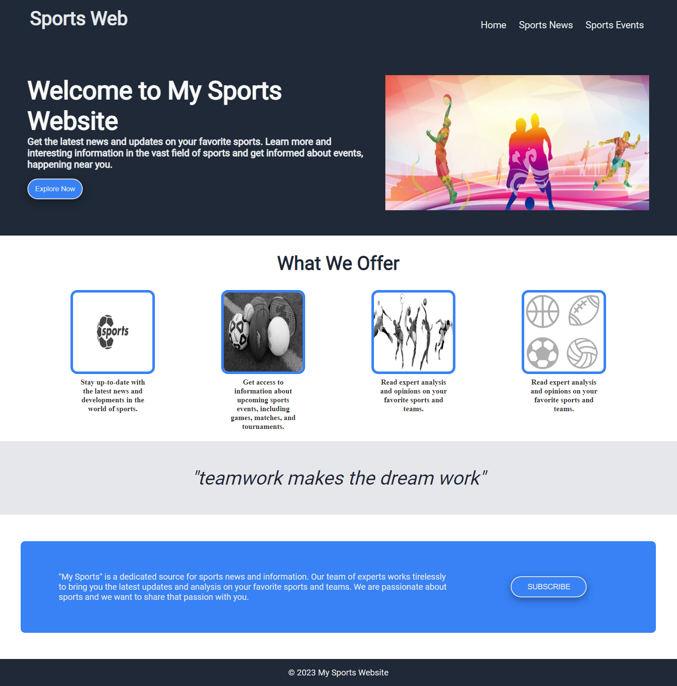

# Our Sports Website

Live site: https://etdesign.github.io/main-css-project/index.html

## Overview

Our Sports Website is a project developed by a team of front-end developers during our training with Brainnest. The project not only showcases our individual skills in front-end development but also demonstrates our ability to work collaboratively as a team.

# Dev Team :

- Basak Sayar
- Emre Turan
- Mubarak Bosa
- Vladislav Kostadinov
- Yazeed Daher

# Our Sports Website

## Table of contents

- [Overview](#overview)
  - [Page](#page)
  - [Sample](#sample)
- [Group](#group)
  - [Members](#members)

### Page

Check out our Project [here](https://etdesign.github.io/main-css-project/index.html)

### Sample

### Members

- Basak Sayar
- Emre Turan
- Mubarak Bosa
- Vladislav Kostadinov
- Yazeed Daher

 We have worked together to ensure the website is functional, responsive, and visually appealing. Through this project, we have gained valuable experience in collaborating as a team and working towards a common goal.

